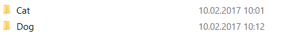
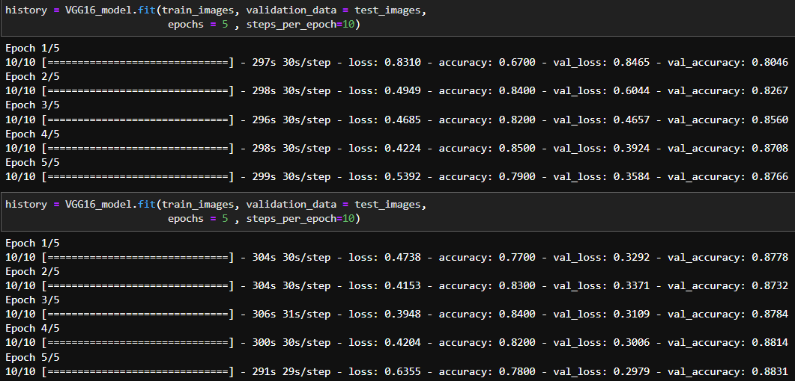
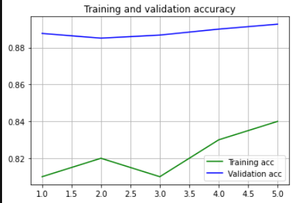

# Cat-Dog-Classification-TransferLearning

This project is about Global AI HUB Summer Camp'22 group assessment project.
In this project we do transfer learning via. VGG16 Model to famous cats-dogs dataset.

To be able to work this model, first you should download the dataset from the link and upload the Cat and Dog folder to this folder as shown below.
https://www.microsoft.com/en-us/download/details.aspx?id=54765

